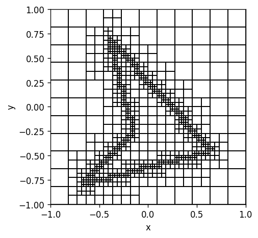

# QuadTree

Super simple but versatile Quad-Tree dataclass for 2D domain discretization with some handy methods for geometry based cell retrieval and refinement. The neighbors of the cells are automatically updated when a cell is split which reduces the complexity of the neighbor search to a managable `n log n` and only at tree construction.


```python
import numpy as np

from matplotlib import pyplot as plt
from matplotlib.collections import PatchCollection
from matplotlib.patches import Rectangle

#import the quadtree 
from quadtree.quadtree import QuadTree
```


```python
#define a polygon
poly = [[-0.67, -0.8], [0.65, -0.45], [-0.4, 0.7], [-0.15, -0.25]]

#helper function to get segments from a polygon
def poly_to_segments(poly):
    return list(zip(poly, poly[-1:]+poly[:-1]))

#get the segments
segments = poly_to_segments(poly)
```


```python
#initialize the quadtree with a bounding box for the root cell and number of initial splits
QT = QuadTree(bounding_box=[[-1,-1], [1,1]], n_initial_x=11, n_initial_y=11)
```


```python
#refine quadtree based on the edges / segments of the polygon
QT.refine_edge(segments)
QT.refine_edge(segments)
QT.refine_edge(segments)

#balance the quadtree
QT.balance()
```


```python
#plot the quadtree
```

# Retrieve leaf cells from the Quadtree

The `QuadTree` class offers some methods for easy leaf cell retrieval with `get_leafs`.


```python
fig, ax = plt.subplots(figsize=(6, 4), dpi=120, tight_layout=True)
ax.set_aspect(1)

rectangles = []
for i, cell in enumerate(QT.get_leafs()):
    w, h = cell.size
    x, y = cell.center
    rectangles.append(Rectangle(xy=[x-w/2, y-h/2], 
                                width=w, 
                                height=h, 
                                ec="k", 
                                fc="none", 
                                lw=1))
ax.add_collection(PatchCollection(rectangles, match_original=True))

ax.set_xlim(-1, 1)
ax.set_ylim(-1, 1)

ax.set_xlabel("x")
ax.set_ylabel("y")
```


    

    


 Or for example the cells with the centers inside a polygon with `get_leafs_inside_polygon`.


```python
fig, ax = plt.subplots(figsize=(6, 4), dpi=120, tight_layout=True)
ax.set_aspect(1)

rectangles = []
for i, cell in enumerate(QT.get_leafs_inside_polygon(poly)):
    w, h = cell.size
    x, y = cell.center
    rectangles.append(Rectangle(xy=[x-w/2, y-h/2], 
                                width=w, 
                                height=h, 
                                ec="k", 
                                fc="none",
                                lw=1))    
ax.add_collection(PatchCollection(rectangles, match_original=True))

ax.set_xlim(-1, 1)
ax.set_ylim(-1, 1)

ax.set_xlabel("x")
ax.set_ylabel("y")
```


    

    


The cells that are cut by some segments and are therefore directly at the interface `get_leafs_cut_by_segments`.


```python
fig, ax = plt.subplots(figsize=(6, 4), dpi=120, tight_layout=True)
ax.set_aspect(1)

rectangles = []
for i, cell in enumerate(QT.get_leafs_cut_by_segments(segments)):
    w, h = cell.size
    x, y = cell.center
    rectangles.append(Rectangle(xy=[x-w/2, y-h/2], 
                                width=w, 
                                height=h, 
                                ec="k", 
                                fc="none",
                                lw=1))
ax.add_collection(PatchCollection(rectangles, match_original=True))

ax.set_xlim(-1, 1)
ax.set_ylim(-1, 1)

ax.set_xlabel("x")
ax.set_ylabel("y")
```


    

    


Or the boundary cells `get_leafs_at_boundary`.


```python
fig, ax = plt.subplots(figsize=(6, 4), dpi=120, tight_layout=True)
ax.set_aspect(1)

rectangles = []
for i, cell in enumerate(QT.get_leafs_at_boundary()):
    w, h = cell.size
    x, y = cell.center
    rectangles.append(Rectangle(xy=[x-w/2, y-h/2], 
                                width=w, 
                                height=h, 
                                ec="k", 
                                fc="none", 
                                lw=1))
ax.add_collection(PatchCollection(rectangles, match_original=True))

ax.set_xlim(-1, 1)
ax.set_ylim(-1, 1)

ax.set_xlabel("x")
ax.set_ylabel("y")
```


    

    


# simple FVM

The quadtree mesh can be used for the domain discretization for finite volume methods. The following is a very simple boundary problem poisson solver (that is only 1st order due to the transitions) based on a cell centered finite volume method.

We just use the same quadtree from before and assign some permittivity to the cells within the polygon. Then we build a linear system based on the FVM scheme. The stencil for each cell is given by its neighbors. The effective permittivity at the cell-cell interface is calculated by resistive weighted mean.


```python
#potentials at the north and south boundary
V_n = 1.0
V_s = -1.0

#set material parameter and cell index
for i, cell in enumerate(QT.get_leafs()):
    cell.set("eps", 1.0)
    cell.set("idx", i)
    
for cell in QT.get_leafs_inside_polygon(poly):
    cell.set("eps", 6.0)

#initialize system    
n = len(QT)
A = np.zeros((n, n))
b = np.zeros(n)

#fill system
for i, cell in enumerate(QT.get_leafs()):    
    w_i, _ = cell.size
    eps_i = cell.get("eps")    
    
    #dirichlet at the top
    if cell.is_boundary_N():
        A[i, i] -= 2 * eps_i
        b[i] -= V_n * 2 * eps_i
        
    #dirichlet at the bottom
    if cell.is_boundary_S():
        A[i, i] -= 2 * eps_i
        b[i] -= V_s * 2 * eps_i
        
    #neighbors
    for neighbor in cell.get_neighbors():
        j = neighbor.get("idx")
        w_j, _ = neighbor.size
        eps_j = neighbor.get("eps")    
        
        a_ij = 2 * min(w_i, w_j) / (w_i/eps_i + w_j/eps_j)
        
        A[i, i] -= a_ij
        A[i, j] += a_ij
    
#solve the system
Phi = np.linalg.solve(A, b)
```


```python
#make a color map from solution
cmap = plt.cm.jet
norm = plt.Normalize(vmin=min(Phi), vmax=max(Phi))
colors = cmap(norm(Phi))

#apply colors to cells according to mapping
for cell, phi, color in zip(QT.get_leafs(), Phi, colors): 
    cell.set("phi", phi)
    cell.set("color", color)

#plot the result
fig, ax = plt.subplots(figsize=(6, 4), dpi=120, tight_layout=True)

ax.set_aspect(1)

rectangles = []
for i, cell in enumerate(QT.get_leafs()):
    w, h = cell.size
    x, y = cell.center
    rectangles.append(Rectangle(xy=[x-w/2, y-h/2], 
                                width=w, 
                                height=h, 
                                ec="k", 
                                fc=cell.get("color"), 
                                lw=1))

ax.add_collection(PatchCollection(rectangles, match_original=True))

fig.colorbar(plt.cm.ScalarMappable(norm=norm, cmap=cmap),
             ax=ax, label="Phi", fraction=0.046, pad=0.03)

ax.fill(*zip(*poly), lw=2, ec="k", fc="none")

ax.set_xlim(-1, 1)
ax.set_ylim(-1, 1)

ax.set_xlabel("x")
ax.set_ylabel("y")

```


    

    

